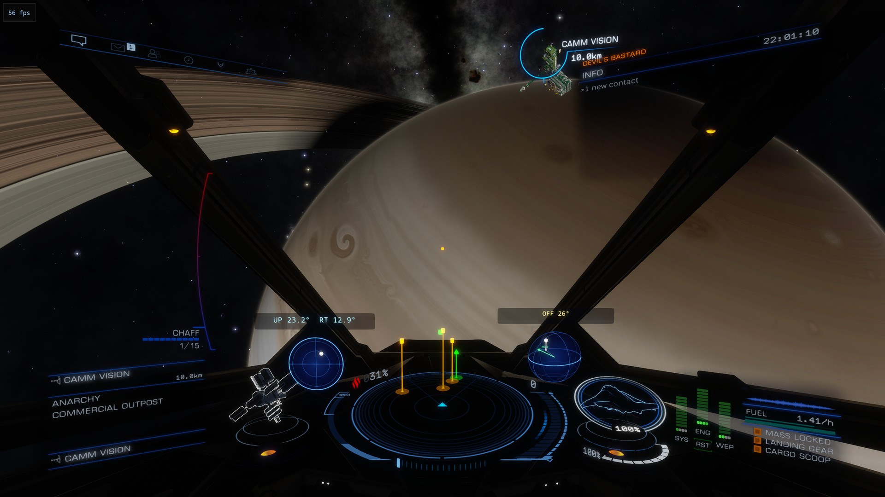

# edworld

A d3d11 proxy for Elite Dangerous that fixes the panel of a hyperspace jump being charged: the right superpower
emblem in place of the wrong one the game shows for the Federation, the Empire and the Alliance (read from the
panel's own text), the independents' phoenix in gold, and the destination's factions listed under the panel. Both
ride the panel when the cockpit camera swings. With Elite Help Tool it also tells EHT's overlay where the cockpit
panels are on screen.

Left, a Federation destination: its emblem drawn by edworld in place of the wrong one the game shows. Right, an
independent one: the phoenix in gold. Under each panel the destination's factions by influence, the controlling one
starred, with the trend at the last tick and their states.

## Beta: navballs, testers wanted

Version 1.1.0-beta.1 added two spheres beside the radar that show where the selected target is, larger and easier to
read than the game's compass. The left one is the sphere seen from the front, as the game's compass shows it, with
the angles above it (`UP`/`DN`, `LT`/`RT`). The right one is the same direction seen from behind, from the left and
from above, with the ship's nose marked and how far the target is off it (`OFF`); in a planet's gravity well, with
the planet targeted, it gives the nose's angle below the horizon, `PUSH DOWN` / `PULL UP` towards a 35° dive, and
the altitude. The direction is read off the game's own compass; the spheres are drawn in the HUD's plane, held to
the compass and to the speed readout, so they move with the cockpit.

Version 1.1.0-beta.2 adds the approach view: with the target low under the wings near a pad, the left sphere shows it
from above (`FWD`/`AFT`, `LT`/`RT`) and the right one a dome standing on it with the ship a point on the dome (in space
the whole sphere, the base a gridded plane, green with the ship over it and red under it), meant to let you come down to a pad
on the spheres alone.

So far the spheres are placed in one cockpit only (the Kestrel). I need testers who fly other ships: install the
beta (`doc/users.md`), then for each ship send me, in an [issue](https://github.com/arturbac/edworld/issues), the
ship's type, a screenshot with both spheres and edworld's log (`edworld.log` or `edworld_eht.log`). The log records
where each sphere was placed and how large (`compass: the left sphere's centre at ...`), which is what I need to
place them right in every cockpit. `compass = 0` in the ini turns the navballs off.

Checked at 9000×2160 only; at 1920×1080 or lower expect little. See the warning in `doc/users.md`.

- Players: [doc/users.md](doc/users.md): what it shows, which dll, install (alone, through edloader, with EHT),
  settings, checking it works, after a verification of the game's files, removing it.
- Developers: [doc/developers.md](doc/developers.md): how it works in the game process, build and test, what was
  found in the game, and how to write a d3d11 plugin of your own on the same pattern.

Version 1.0.0, beta 1.1.0-beta.2 ([CHANGELOG.md](CHANGELOG.md)). Observing is read-only: every hook calls the game's call through
unchanged; the jump panel's emblem and list and the navballs are the only things edworld changes in what the game draws. edworld runs on its own as
the game's `d3d11.dll`, passing the calls on to one other d3d11 mod (`next`), or through
[edloader](https://github.com/arturbac/edloader) together with several; the release zip carries edloader in its
`edloader` folder. Checked in the game: alone in front of EDHM; through edloader with EDHM; through edloader with
EDHM and EDVR 0.18.0 (EDHM listed before EDVR) for the jump panel. The navballs are checked through edloader with
EDHM, not yet with EDVR. MIT licence (LICENSE).

## Credits

edworld builds on the work of the [EDVR unofficial patch](https://github.com/characterecho-sean/edvr-unofficial-patch)
team (MIT): the proxy chaining discipline, the export thunk generator (`tools/gen_exports.py`, unchanged), the
shader hash and EDVR's decode of the cockpit panels' constant buffers and instance records. It also uses
[Dear ImGui](https://github.com/ocornut/imgui) (MIT), the emblems of
[EDAssets](https://github.com/Venefilyn/EDAssets) (MIT; artwork of Frontier Developments) and the
[Noto Sans Mono](https://github.com/notofonts/latin-greek-cyrillic) font (SIL OFL 1.1). What comes from where,
file by file, with the licence texts: `NOTICE`.
