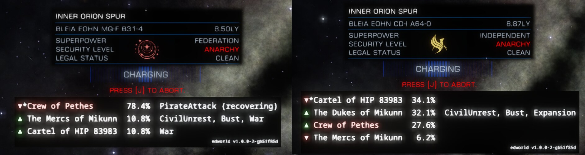

# edworld

A d3d11 proxy for Elite Dangerous that fixes the panel of a hyperspace jump being charged: the right superpower
emblem in place of the wrong one the game shows for the Federation, the Empire and the Alliance (read from the
panel's own text), the independents' phoenix in gold, and the destination's factions listed under the panel. Both
ride the panel when the cockpit camera swings. With Elite Help Tool it also tells EHT's overlay where the cockpit
panels are on screen.

Left, a Federation destination: its emblem drawn by edworld in place of the wrong one the game shows. Right, an
independent one: the phoenix in gold. Under each panel the destination's factions by influence, the controlling one
starred, with the trend at the last tick and their states.

- Players: [doc/users.md](doc/users.md): what it shows, which dll, install (alone, through edloader, with EHT),
  settings, checking it works, after a verification of the game's files, removing it.
- Developers: [doc/developers.md](doc/developers.md): how it works in the game process, build and test, what was
  found in the game, and how to write a d3d11 plugin of your own on the same pattern.

Version 1.0.0 ([CHANGELOG.md](CHANGELOG.md)). Observing is read-only: every hook calls the game's call through
unchanged; the jump panel's emblem and list are the only things edworld changes in what the game draws. Checked in
the game alone in front of EDHM, and through edloader together with EDHM. MIT licence (LICENSE).

## Credits

edworld builds on the work of the [EDVR unofficial patch](https://github.com/characterecho-sean/edvr-unofficial-patch)
team (MIT): the proxy chaining discipline, the export thunk generator (`tools/gen_exports.py`, unchanged), the
shader hash and EDVR's decode of the cockpit panels' constant buffers and instance records. It also uses
[Dear ImGui](https://github.com/ocornut/imgui) (MIT), the emblems of
[EDAssets](https://github.com/Venefilyn/EDAssets) (MIT; artwork of Frontier Developments) and the
[Noto Sans Mono](https://github.com/notofonts/latin-greek-cyrillic) font (SIL OFL 1.1). What comes from where,
file by file, with the licence texts: `NOTICE`.
